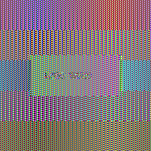

# Laboratorio Block — Cifrados de Bloque

Universidad del Valle de Guatemala · Cifrado de Información · 2026

---

## Instalación y uso

```bash
pip install -r requirements.txt
```

```
Laboratorio_Block/
├── src/
│   ├── utils.py            # claves, IV, nonce y padding PKCS#7 manual
│   ├── des_cipher.py       # DES-ECB
│   ├── tripledes_cipher.py # 3DES-CBC
│   ├── aes_cipher.py       # AES ECB / CBC / CTR + cifrado de imágenes
│   └── padding_oracle.py   # demo de Padding Oracle (extra)
├── tests/
│   └── test_ciphers.py
├── images/
│   ├── generate_images.py
│   ├── original.png
│   ├── aes_ecb.png
│   └── aes_cbc.png
└── requirements.txt
```

---

## Ejemplos de ejecución

### DES-ECB

```python
from src.utils import generar_clave_des
from src.des_cipher import cifrar_des_ecb, descifrar_des_ecb

clave    = generar_clave_des()
cifrado  = cifrar_des_ecb(b"Hola DES!", clave)
original = descifrar_des_ecb(cifrado, clave)
```

```bash
python src/des_cipher.py
```

```
Original  : b'Hola DES!'
Cifrado   : a3f72c1b9e4d0582...
Descifrado: b'Hola DES!'
Coincide  : True
```

---

### 3DES-CBC

```python
from src.utils import generar_clave_3des, generar_iv
from src.tripledes_cipher import cifrar_3des_cbc, descifrar_3des_cbc

clave    = generar_clave_3des(n_claves=2)   # 16 bytes
iv       = generar_iv(8)
cifrado  = cifrar_3des_cbc(b"Mensaje secreto", clave, iv)
original = descifrar_3des_cbc(cifrado, clave, iv)
```

> En una implementación real el IV viaja junto al texto cifrado: se concatena al inicio (`iv + cifrado`) y se separa al descifrar (`iv, ct = data[:8], data[8:]`).

```bash
python src/tripledes_cipher.py
```

---

### AES — ECB, CBC y CTR

```python
from src.utils import generar_clave_aes, generar_iv, generar_nonce
from src.aes_cipher import cifrar_aes_ecb, cifrar_aes_cbc, cifrar_aes_ctr

clave = generar_clave_aes(256)
iv    = generar_iv(16)
nonce = generar_nonce(8)
msg   = b"Mensaje AES"

cifrar_aes_ecb(msg, clave)
cifrar_aes_cbc(msg, clave, iv)
cifrar_aes_ctr(msg, clave, nonce)   # sin padding
```

```bash
python src/aes_cipher.py
```

### Imágenes ECB vs CBC

```bash
python images/generate_images.py
```

---

## Testing

```bash
python tests/test_ciphers.py
```

```
  PASS  test_relleno_5_bytes
  PASS  test_relleno_8_bytes
  PASS  test_relleno_10_bytes
  PASS  test_relleno_ida_vuelta
  PASS  test_des_ecb_cifrar_descifrar
  PASS  test_des_ecb_bloques_identicos
  PASS  test_des_clave_longitud
  PASS  test_3des_cbc_2_claves
  PASS  test_3des_cbc_3_claves
  PASS  test_3des_longitud_claves
  PASS  test_3des_iv_distinto_ciphertext_distinto
  PASS  test_3des_mismo_iv_mismo_ciphertext
  PASS  test_aes_ecb_cifrar_descifrar
  PASS  test_aes_ecb_bloques_identicos
  PASS  test_aes_longitud_clave
  PASS  test_aes_cbc_cifrar_descifrar
  PASS  test_aes_cbc_iv_distinto_ciphertext_distinto
  PASS  test_aes_cbc_sin_bloques_identicos
  PASS  test_aes_ctr_cifrar_descifrar
  PASS  test_aes_ctr_sin_padding
  PASS  test_aes_ctr_nonce_distinto_ciphertext_distinto

Total: 21 tests pasados.
```

| Grupo | Qué se verifica |
|-------|-----------------|
| PKCS#7 (4) | padding correcto para 5, 8 y 10 bytes; ida y vuelta |
| DES-ECB (3) | cifrar/descifrar, bloques iguales → mismo cifrado |
| 3DES-CBC (5) | cifrar/descifrar con 2 y 3 claves, efecto del IV |
| AES-ECB (3) | cifrar/descifrar, bloques iguales → mismo cifrado |
| AES-CBC (3) | cifrar/descifrar, IV distinto → cifrado distinto |
| AES-CTR (3) | cifrar/descifrar, sin padding, nonce distinto → cifrado distinto |

---

## Comparación visual ECB vs CBC

| Original | AES-ECB | AES-CBC |
|----------|---------|---------|
|  |  |  |

En la imagen ECB se siguen viendo las franjas de color porque bloques de píxeles idénticos siempre producen el mismo resultado al cifrarse. En CBC cada bloque depende del anterior, así que la imagen queda como ruido sin ningún patrón visible.

El código que genera las imágenes (`images/generate_images.py`) extrae los bytes de píxeles, los cifra y reconstruye la imagen con el mismo tamaño:

```python
def cifrar_imagen_ecb(ruta_entrada, clave, ruta_salida):
    img = Image.open(ruta_entrada).convert("RGB")
    datos = img.tobytes()
    cifrado = AES.new(clave, AES.MODE_ECB).encrypt(pad(datos, 16))[:len(datos)]
    Image.frombytes("RGB", img.size, cifrado).save(ruta_salida)
```

---

## Análisis de seguridad

### 2.1 Tamaños de clave

| Algoritmo | Clave | Bits reales |
|-----------|-------|------------|
| DES | 8 bytes (64 bits) | **56 bits** (8 son de paridad) |
| 3DES con 2 claves | 16 bytes | **112 bits** |
| 3DES con 3 claves | 24 bytes | **112 bits** (el ataque meet-in-the-middle lo reduce) |
| AES-256 | 32 bytes | **256 bits** |

```python
def generar_clave_des() -> bytes:
    return secrets.token_bytes(8)

def generar_clave_3des(n_claves: int = 2) -> bytes:
    longitud = 16 if n_claves == 2 else 24
    while True:
        clave = secrets.token_bytes(longitud)
        try:
            return DES3.adjust_key_parity(clave)
        except ValueError:
            continue

def generar_clave_aes(bits: int = 256) -> bytes:
    return secrets.token_bytes(bits // 8)
```

```
DES key : b085c6a56f00adcf          ( 8 bytes =  64 bits)
3DES-2K : e94ffd522a9eb3b07325...   (16 bytes = 128 bits)
3DES-3K : f798b9a22fa79134613b...   (24 bytes = 192 bits)
AES-256 : 8b6bf37b6702694ce8b6...   (32 bytes = 256 bits)
```

DES es inseguro porque sus 56 bits efectivos son muy pocos. En 1999 fue roto en 22 horas con hardware dedicado. Hoy con una GPU moderna se prueban ~10⁹ claves por segundo, lo que con un clúster de 1000 GPUs lo rompería en alrededor de 20 horas. Con chips especializados, en minutos. Desde 1999 NIST lo tiene como deprecado y no debería usarse en nada nuevo.

---

### 2.2 Comparación de modos

| Algoritmo | Modo |
|-----------|------|
| DES | ECB |
| 3DES | CBC |
| AES | ECB, CBC y CTR |

**ECB** cifra cada bloque por separado con la misma clave, sin depender de nada más. Bloques iguales siempre dan el mismo resultado, lo que revela patrones del mensaje original.

**CBC** mezcla cada bloque con el cifrado del bloque anterior antes de cifrarlo. El primero se mezcla con el IV. Aunque el mensaje tenga partes repetidas, el resultado siempre es diferente.

```
ECB:  C_i = E(K, P_i)
CBC:  C_i = E(K, P_i XOR C_{i-1}),  C_0 = IV
```

La diferencia se ve directamente en las imágenes de arriba: ECB conserva los colores, CBC no.

---

### 2.3 Vulnerabilidad de ECB

El problema de ECB es que el mismo bloque de texto siempre da el mismo cifrado. Con bloques de 8 bytes en DES:

```python
clave  = generar_clave_des()
bloque = b"ATACAR!!"
cifrado = cifrar_des_ecb(bloque * 3, clave)
```

```
Bloque 1: 5ff98afa4c3bf20d
Bloque 2: 5ff98afa4c3bf20d   ← igual
Bloque 3: 5ff98afa4c3bf20d   ← igual
```

Con AES y bloques de 16 bytes pasa lo mismo. En CBC el resultado es diferente aunque el texto sea idéntico:

```
Texto: "ATAQUE!!ATAQUE!!" × 3

AES-ECB:
  B1: 53af798a449ca567238ddf8a9978aa15
  B2: 53af798a449ca567238ddf8a9978aa15   ← igual a B1
  B3: 53af798a449ca567238ddf8a9978aa15   ← igual a B1

AES-CBC:
  B1: e89a0c6fbd54bda686dde951c7cc5a05
  B2: 1ce99b0e4bfc093d640b69d68889764a
  B3: d2ff58552ca7b5eb733c8101f308c026
```

Esto es un problema real: en bases de datos donde varias personas tienen la misma contraseña, sus registros cifrados con ECB serían idénticos. Un atacante podría detectarlo sin descifrar nada.

---

### 2.4 Vector de Inicialización (IV)

El IV es un valor aleatorio que se mezcla con el primer bloque en CBC para que el mismo mensaje con la misma clave nunca produzca el mismo resultado. ECB no lo necesita porque no hay encadenamiento.

```python
clave   = generar_clave_aes(256)
iv_fijo = bytes(16)          # mal uso — nunca hacer esto
iv_rand = generar_iv(16)
msg     = b"Mensaje de prueba"

ct1 = cifrar_aes_cbc(msg, clave, iv_fijo)
ct2 = cifrar_aes_cbc(msg, clave, iv_fijo)   # mismo IV
ct3 = cifrar_aes_cbc(msg, clave, iv_rand)   # IV distinto
```

```
Mismo IV:
  CT1: 5c0f7dfa3924f2471cc55d23ce95915e...
  CT2: 5c0f7dfa3924f2471cc55d23ce95915e...   ← idéntico

IV distinto:
  CT3: 586aed1623e06129ab96607d6ea72290...   ← diferente
```

Si se reutiliza el mismo IV y clave con dos mensajes, un atacante que conozca uno de los mensajes puede deducir partes del otro haciendo XOR entre los cifrados. Por eso el IV debe generarse con `secrets.token_bytes()` en cada operación.

---

### 2.5 Padding

Los cifradores de bloque necesitan que el mensaje sea exactamente múltiplo del tamaño del bloque. PKCS#7 rellena los bytes que faltan con el valor de cuántos bytes se agregaron. Si el mensaje ya es múltiplo exacto, igual se agrega un bloque completo (así el descifrado siempre sabe qué quitar).

```python
def rellenar_pkcs7(datos: bytes, tamano_bloque: int = 8) -> bytes:
    n = tamano_bloque - (len(datos) % tamano_bloque)
    return datos + bytes([n]) * n

def quitar_relleno_pkcs7(datos: bytes) -> bytes:
    n = datos[-1]
    return datos[:-n]
```

Con bloque de 8 bytes:

| Mensaje | Resultado (hex) | Bytes agregados |
|---------|----------------|-----------------|
| `ABCDE` (5) | `4142434445 03 03 03` | 3 × `0x03` |
| `ABCDEFGH` (8) | `4142434445464748 08×8` | 8 × `0x08` (bloque completo) |
| `ABCDEFGHIJ` (10) | `4142434445464748494a 06×6` | 6 × `0x06` |

```
5 bytes  -> 4142434445030303                  len=8
8 bytes  -> 41424344454647480808080808080808   len=16
10 bytes -> 4142434445464748494a060606060606   len=16
Unpad 5  -> b'ABCDE'
Unpad 8  -> b'ABCDEFGH'
Unpad 10 -> b'ABCDEFGHIJ'
```

---

### 2.6 ¿Cuándo usar cada modo?

| Modo | Necesita IV | Padding | Se puede paralelizar | Autenticado | Para qué sirve |
|------|-------------|---------|----------------------|-------------|----------------|
| ECB | No | Sí | Sí | No | No usar en producción |
| CBC | Sí | Sí | Solo al descifrar | No | Sistemas legados |
| CTR | Sí (nonce) | No | Sí | No | Streaming, archivos grandes |
| GCM | Sí (nonce) | No | Sí | Sí | Todo uso nuevo |

GCM es el recomendado hoy porque cifra y verifica integridad al mismo tiempo, sin necesitar nada extra.

**Python:**

```python
from Crypto.Cipher import AES
import secrets

clave = secrets.token_bytes(32)
nonce = secrets.token_bytes(12)

cifrador = AES.new(clave, AES.MODE_GCM, nonce=nonce)
ct, tag = cifrador.encrypt_and_digest(b"Mensaje")

cifrador2 = AES.new(clave, AES.MODE_GCM, nonce=nonce)
texto = cifrador2.decrypt_and_verify(ct, tag)
```

**Node.js:**

```javascript
const { createCipheriv, createDecipheriv, randomBytes } = require('crypto');

const clave = randomBytes(32);
const nonce = randomBytes(12);

const cifrador = createCipheriv('aes-256-gcm', clave, nonce);
const ct  = Buffer.concat([cifrador.update('Mensaje', 'utf8'), cifrador.final()]);
const tag = cifrador.getAuthTag();

const descifrador = createDecipheriv('aes-256-gcm', clave, nonce);
descifrador.setAuthTag(tag);
const texto = Buffer.concat([descifrador.update(ct), descifrador.final()]).toString('utf8');
```

---

## Extra

### 3.1 Modo CTR

CTR convierte AES en un cifrador de flujo: genera una secuencia de bytes a partir de un contador y los mezcla con el texto. No necesita padding.

```python
def cifrar_aes_ctr(texto_plano, clave, nonce):
    return AES.new(clave, AES.MODE_CTR, nonce=nonce).encrypt(texto_plano)
```

Cifrando 10 MB:

```
CBC: 32.5 ms
CTR: 18.4 ms   (~43% más rápido)
```

CTR es más rápido porque cada bloque es independiente y se puede procesar en paralelo. En CBC cada bloque depende del anterior, así que no hay opción.

---

### 3.2 Padding Oracle Attack

Si un sistema indica de alguna forma si el padding de un mensaje descifrado es válido o no (error, tiempo de respuesta, etc.), un atacante puede usar esa pista para recuperar el mensaje original bloque por bloque sin saber la clave.

```bash
python src/padding_oracle.py
```

```
Ejecutando Padding Oracle Attack...
  Original  : b'Secreto del servidor!!'
  Recuperado: b'Secreto del servidor!!'
  Exitoso   : True
```

Este tipo de ataque fue real: POODLE (2014) en SSLv3 y Lucky 13 (2013) en TLS lo usaron para descifrar tráfico. La solución es usar GCM, que no tiene padding, o verificar siempre la integridad del mensaje antes de descifrarlo.
